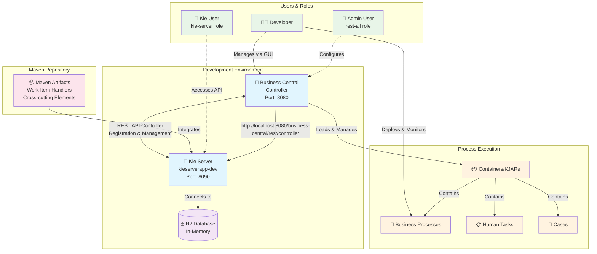
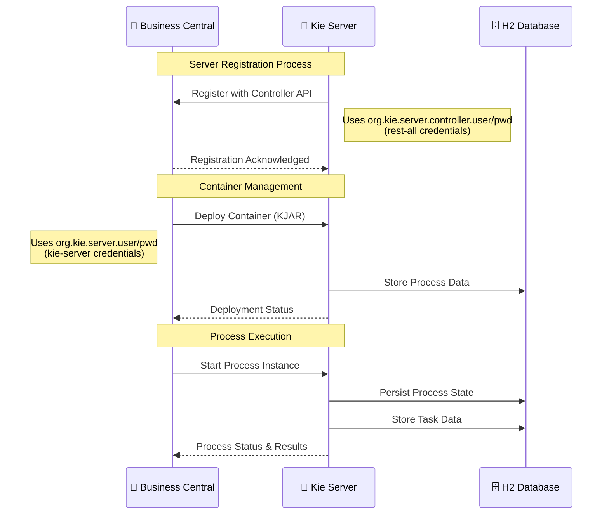
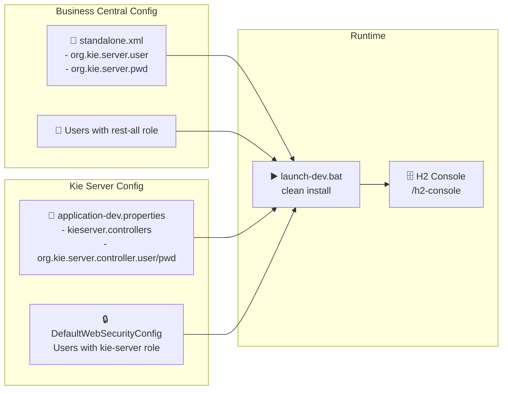

# 🏗️ Architecture Diagram

## 🔄 Kie Server and Business Central Relationship

```mermaid
graph TB
    subgraph "Development Environment"
        BC[🏢 Business Central<br/>Controller<br/>Port: 8080]
        KS[🚀 Kie Server<br/>kieserverapp-dev<br/>Port: 8090]
        H2[(🗄️ H2 Database<br/>In-Memory)]
    end
    
    subgraph "Users & Roles"
        DEV[👨‍💻 Developer]
        ADMIN[👥 Admin User<br/>rest-all role]
        KIEUSER[🔧 Kie User<br/>kie-server role]
    end
    
    subgraph "Maven Repository"
        MAVEN[📦 Maven Artifacts<br/>Work Item Handlers<br/>Cross-cutting Elements]
    end
    
    subgraph "Process Execution"
        PROC[🔄 Business Processes]
        TASKS[📋 Human Tasks]
        CASES[📂 Cases]
        CONT[📦 Containers/KJARs]
    end
    
    %% Connections
    BC <-->|REST API Controller<br/>Registration & Management| KS
    KS -->|Connects to| H2
    DEV -->|Manages via GUI| BC
    DEV -->|Deploys & Monitors| PROC
    
    BC -->|Loads & Manages| CONT
    CONT -->|Contains| PROC
    CONT -->|Contains| TASKS
    CONT -->|Contains| CASES
    
    MAVEN -->|Integrates| KS
    ADMIN -.->|Configures| BC
    KIEUSER -.->|Accesses API| KS
    
    BC -->|http://localhost:8080/business-central/rest/controller| KS
    
    %% Styling
    classDef server fill:#e1f5fe
    classDef database fill:#f3e5f5
    classDef user fill:#e8f5e8
    classDef process fill:#fff3e0
    classDef maven fill:#fce4ec
    
    class BC,KS server
    class H2 database
    class DEV,ADMIN,KIEUSER user
    class PROC,TASKS,CASES,CONT process
    class MAVEN maven
```

## 🔐 Authentication Flow

```mermaid
sequenceDiagram
    participant BC as 🏢 Business Central
    participant KS as 🚀 Kie Server
    participant H2 as 🗄️ H2 Database
    
    Note over BC,KS: Server Registration Process
    KS->>BC: Register with Controller API
    Note right of KS: Uses org.kie.server.controller.user/pwd<br/>(rest-all credentials)
    BC-->>KS: Registration Acknowledged
    
    Note over BC,KS: Container Management
    BC->>KS: Deploy Container (KJAR)
    Note left of BC: Uses org.kie.server.user/pwd<br/>(kie-server credentials)
    KS->>H2: Store Process Data
    KS-->>BC: Deployment Status
    
    Note over BC,KS: Process Execution
    BC->>KS: Start Process Instance
    KS->>H2: Persist Process State
    KS->>H2: Store Task Data
    KS-->>BC: Process Status & Results
```

## 🛠️ Configuration Overview

```mermaid
graph LR
    subgraph "Business Central Config"
        BCConf[📄 standalone.xml<br/>- org.kie.server.user<br/>- org.kie.server.pwd]
        BCUsers[👥 Users with rest-all role]
    end
    
    subgraph "Kie Server Config"
        KSProps[📄 application-dev.properties<br/>- kieserver.controllers<br/>- org.kie.server.controller.user/pwd]
        KSSec[🔒 DefaultWebSecurityConfig<br/>Users with kie-server role]
    end
    
    subgraph "Runtime"
        Launch[▶️ launch-dev.bat<br/>clean install]
        Console[🗄️ H2 Console<br/>/h2-console]
    end
    
    BCConf --> Launch
    BCUsers --> Launch
    KSProps --> Launch
    KSSec --> Launch
    Launch --> Console
```